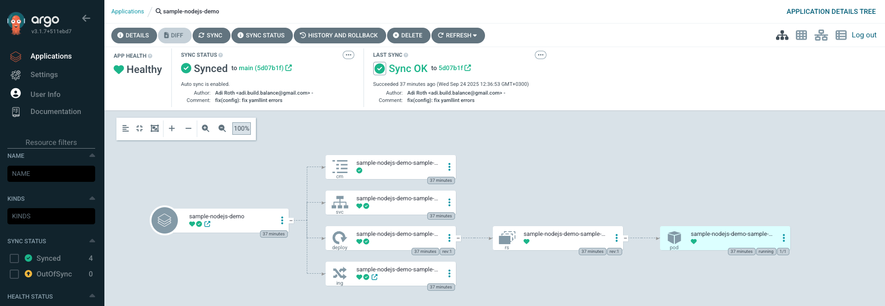
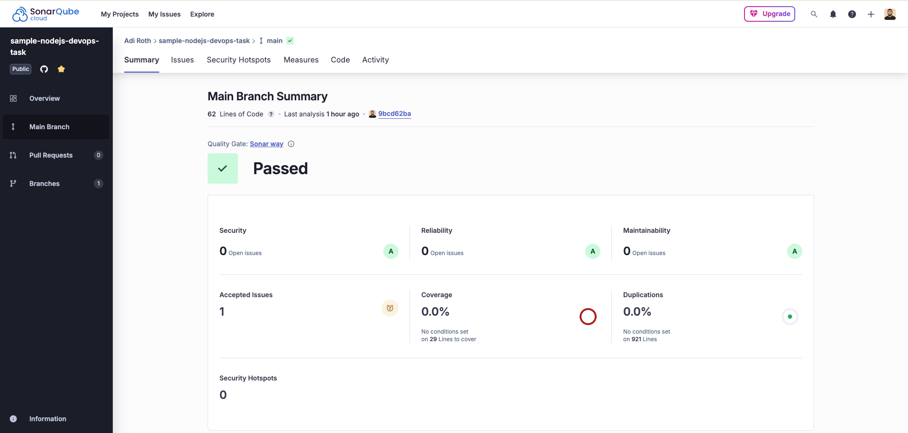
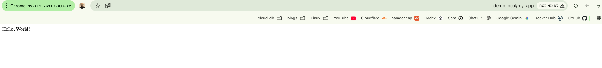
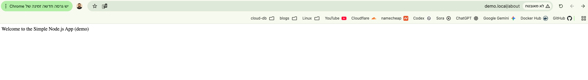
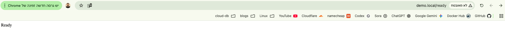
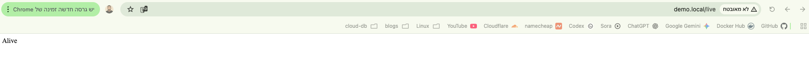
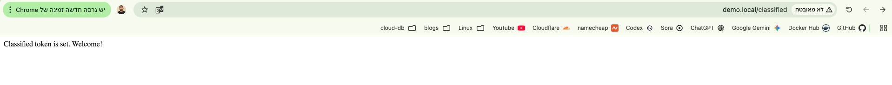
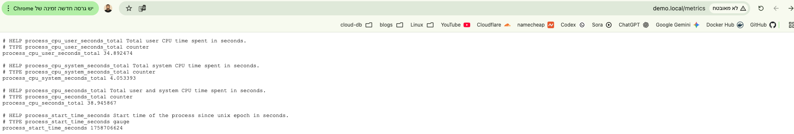

# Sample Nodejs Devops Task

    

This repository contains 3 main folders that represent the devops's task requirements.

## Structure

- [Application](./app/): contains application files + dockerfile (more information at [readme file](./app/README.md)).
- [Helm chart](./chart/): contains a helm chart for the application (more information at [readme file](./chart/README.md)).
- [ArgoCD configuration](./config/): contains configuration for ArgoCD (more information at [readme file](./config/README.md)).

## Architectural Decisions

- **Separation of concerns**:  
  The repository is split into `app/`, `chart/`, and `config/` folders to mimic enterprise-style separation between application code, packaging (Helm), and GitOps configuration (ArgoCD).  
  This allows each part to be managed independently or even hosted in separate repositories in a real-world setup.

- **Production-grade Helm chart**:  
  The chart includes configurable probes, resources, optional ingress with TLS, and ConfigMap/Secret integration.  
  These reflect common production practices while keeping the chart lightweight and reusable.

- **GitOps-first approach**:  
  The `config/` folder is designed for ArgoCD consumption, with `applications.yaml` and environment-specific overlays (values/secrets).  
  This demonstrates how changes flow from Git to cluster declaratively.

- **Secrets management**:  
  In this demo, the `Secret` is hardcoded under `config/demo/secret-classified-token.yaml` for simplicity.  
  In a real-world production setup, secrets should be managed by a secure vault (e.g., HashiCorp Vault, AWS Secrets Manager, Kubernetes External Secrets).  
  The vault would inject secrets dynamically at deployment time, eliminating the need to store them in Git.

- **Security and best practices**:  
  - No hardcoded sensitive values in templates (all injected via ConfigMap/Secret).  
  - `automountServiceAccountToken: false` by default to reduce attack surface.  
  - Resource requests/limits included to ensure scheduling stability.  
  - Added a `CODEOWNERS` file to enforce mandatory reviews for changes under the `config/` folder.  
    This simulates **RBAC-like hardening** in a real enterprise GitOps repo, where config changes must be explicitly reviewed and approved by DevOps/SRE owners.

- **Scalability and portability**:  
  By using Helm + ArgoCD, the same application can be deployed across multiple environments (dev/staging/prod) with minimal changes.

## Screenshots

ArgoCD applications information:

Sonarqube analysis:

### Application endpoints at browser

`/my-app`:

`/about`:

`/ready`:

`/live`:

`/classified`:

`/metrics`:

